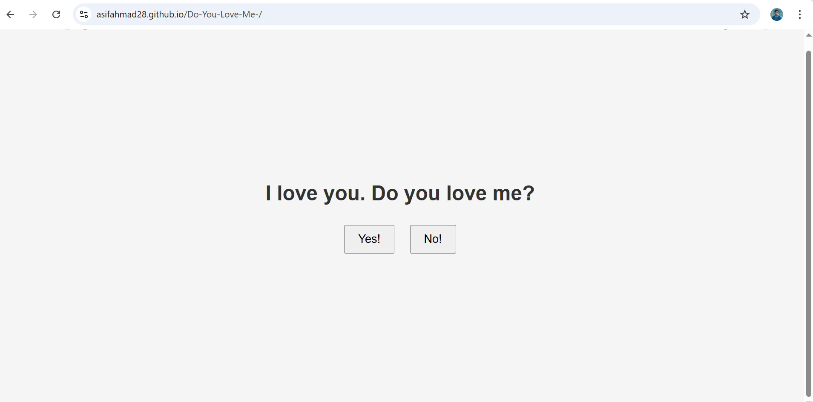
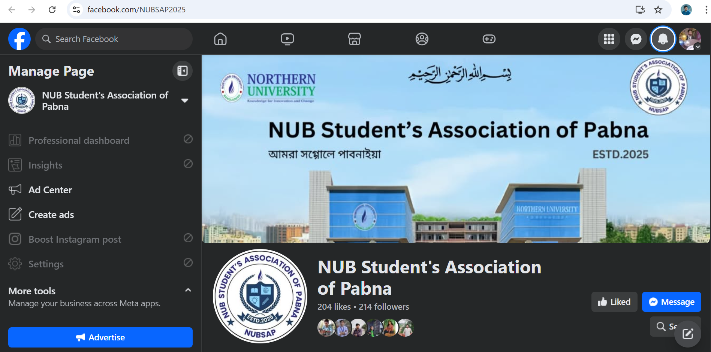

<!DOCTYPE html>
<html lang="en">
<head>
    <meta charset="UTF-8">
    <meta name="viewport" content="width=device-width, initial-scale=1.0">
    <title>Asif Ahmad | Portfolio</title>
    <link rel="stylesheet" href="style.css">
    <link href="https://fonts.googleapis.com/css2?family=Poppins:wght@400;600&family=Open+Sans&display=swap" rel="stylesheet">
</head>
<body>
    <!-- Navigation -->
    <nav>
        

            <a href="#" class="logo">Asif Ahmad</a>
            

                <a href="#projects">Projects</a>
                <a href="#skills">Skills</a>
                <a href="#about">About</a>
                <a href="#contact">Contact</a>
            

        

    </nav>

    <!-- Hero Section -->
    <section class="hero">
        

            
            <h1>Asif Ahmad</h1>
            
Frontend Developer | Writer | Digital Marketer

            
Crafting seamless web experiences and impactful digital solutions.

            <a href="#contact" class="cta-button">Let's Connect!</a>
        

    </section>

    <!-- Projects Section -->
    <section id="projects" class="projects">
        

            <h2>My Projects</h2>
            

                <!-- Project 1 -->
                

                    <h3>Do You Love Me? (HTML)</h3>
                    
A fun interactive project.

                    

                        
                    

                    <a href="https://asifahmad28.github.io/Do-You-Love-Me/" target="_blank" class="project-link">View Project</a>
                

                
                <!-- Project 2 -->
                

                    <h3>NUBSAP</h3>
                    
Student's Org facebook page.

                    

                        
                    

                    <a href="https://www.facebook.com/NUBSAP2025" target="_blank" class="project-link">View Project</a>
                

            

        

    </section>

    <!-- Skills Section -->
    <section id="skills" class="skills">
        

            <h2>My Skills</h2>
            

                
HTML

                
CSS

                
JavaScript

                
C

                
C++

                
Digital Marketing

                
Canva Design

                
Content Writing

            

        

    </section>

    <!-- About Section -->
    <section id="about" class="about">
        

            <h2>About Me</h2>
            
A passionate Frontend Developer with expertise in HTML/CSS, JavaScript, C, and C++, dedicated to crafting seamless and responsive web experiences. As a skilled Writer and Digital Marketer, I blend creativity with strategy to drive engaging content and effective campaigns.

            
With a knack for problem-solving and a love for clean code, I thrive at the intersection of technology and creativity. Always eager to learn, innovate, and deliver impactful digital solutions.

        

    </section>

    <!-- Contact Section -->
    <section id="contact" class="contact">
        

            <h2>Get In Touch</h2>
            

                <a href="mailto:asifahmad280820ttp@gmail.com" class="contact-link">Email Me</a>
                <a href="https://wa.me/8801521514214" class="contact-link">WhatsApp</a>
            

            

                <a href="https://www.linkedin.com/in/asifahmad280820/" target="_blank">LinkedIn</a>
                <a href="https://github.com/asifahmad28" target="_blank">GitHub</a>
                <a href="https://www.facebook.com/asifahmad2808" target="_blank">Facebook</a>
            

        

    </section>

    
</body>
</html>
